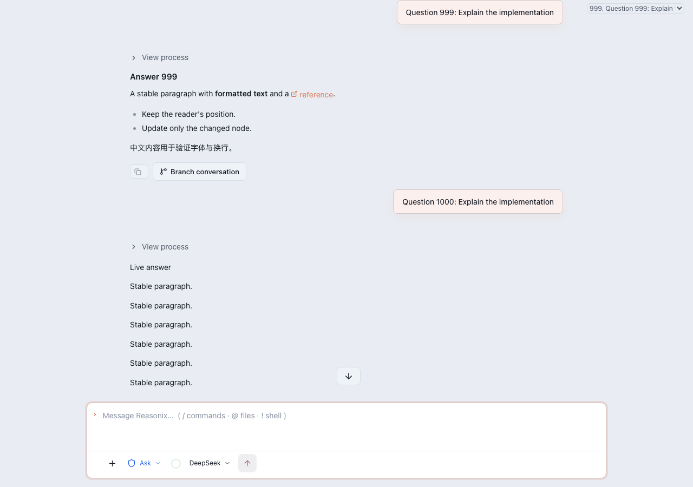
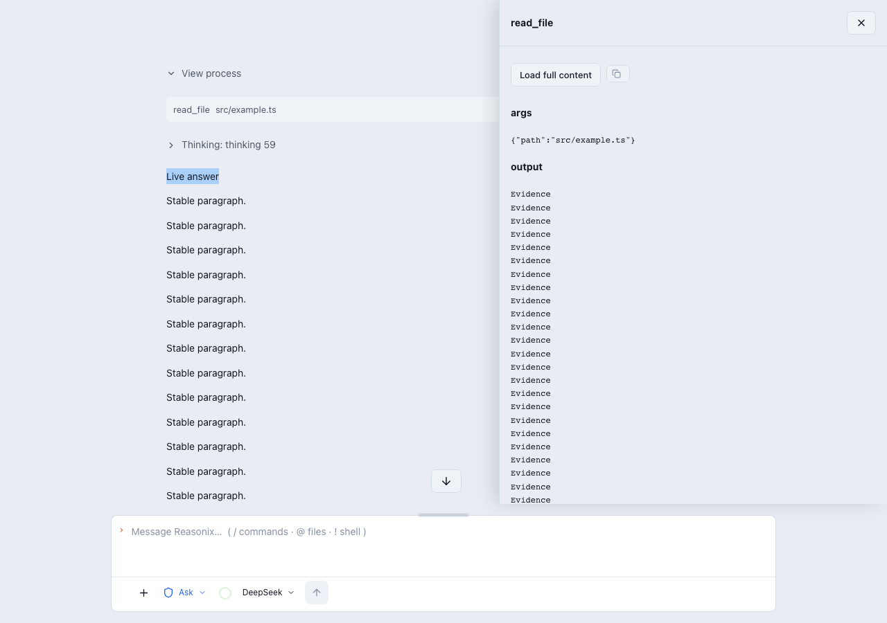

# Reasonix 聊天区一次性重构：交付与验收

[English](CHAT_REFACTOR_ACCEPTANCE.md) · [架构与功能取舍](TRANSCRIPT_ARCHITECTURE.zh-CN.md) · [原始环境](evidence/chat-refactor/environment.json)

> 本报告记录 2026-09-12 的自然文档流重构。后续完成的内容宿主、可信文件事实、统一资源和调用详情实现，以及 2026-09-13 的 Chromium、WebKit、Electron 新证据，见[聊天内容与交互宿主](CHAT_CONTENT_HOST.zh-CN.md)。

日期：2026-09-12。实现位于 `fix/harness-chat-transcript` 工作树，基线为 `0e5319ad145b2c40dd2601ac0d7be0782556114b`，参考 Harness `c291e7961a`。本次验证包含未提交改动；报告中的构建 commit 表示基线，不是新建的交付提交。

## 交付内容

- 本地与远程聊天统一采用自然文档流，累积保留已加载历史；删除虚拟列表、冷热区交接、几何账本、Markdown 窗口和跨窗口逻辑选区。
- 新增 ChatSource 稳定顺序与独立节点订阅、ChatScrollController 单一滚动控制层、四并发全文加载器、按轮折叠过程和工具详情抽屉。
- 流式与完成回答使用同一 Markdown 宿主；保留完整正文、安全链接、图片、引用、公式与图表。工具和思考预览 8,000 字符，代码默认折叠 200 行以后的部分。
- 聊天操作保留复制、普通会话分支及必要故障恢复；移除消息编辑重发、回退、工作树分支、交付与验收工作流入口，以及旧思考面板和旧轮次导航。
- 保留输入框、发送停止、审批、提问、模型设置、项目导航和工作台；不改变后端协议、历史格式、模型输入或 prompt-cache 字节。
- 清理后续核查发现的两个数据边界：工具详情读取原始完整内容而非归档预览；正文与思考并行加载时按字段合并，远程批量提交不相互覆盖。
- 旧版历史取消整页全文预取，统一接受四并发预算；工具内容按调用引用独立读取，过期正文引用不冒充完整内容。

完整功能取舍表、源文件职责、恢复规则和复现命令见[架构说明](TRANSCRIPT_ARCHITECTURE.zh-CN.md)。产品内只有一套聊天实现，无旧版切换开关。

## 自动化回归

| 检查 | 结果与证据 |
| --- | --- |
| 全量前端测试发现 | 337 套通过；后续修改另外执行相关定向复测。[日志](evidence/chat-refactor/unit-discovery.log) |
| transcript / store / Markdown / 并发 | 通过；包含 120 次独立节点更新、稳定顺序、最终节点身份、原生选区、分块内容、四并发、跨字段并发和抽屉过期请求。[日志](evidence/chat-refactor/transcript.log) |
| 原 #185 类崩溃回归 | 真实 Transcript 连续 60 次内容／尺寸提交通过；浏览器另有 60 次尺寸增长及流式回放 |
| stream、composer、remote、app lifecycle、motion | 对应套件通过；远程与生命周期在最后接线修改后复测。[远程](evidence/chat-refactor/remote.log)、[生命周期](evidence/chat-refactor/app-lifecycle.log)、[motion](evidence/chat-refactor/motion.log) |
| 输入与阅读 | 真实键盘输入、PageUp、浏览器触控输入、滚轮、输入框换行增高、手动调整高度、组合事件回放通过；阅读位置偏移为 0 px。[日志](evidence/chat-refactor/composer-browser.log) |
| 应用装配 | 模型切换、创建／工作台布局、文件视图、终端、本地／远程切换、远程新会话、发送与停止通过；Composer 和工作区 DOM 保持。[应用](evidence/chat-refactor/app-browser.log)、[文件视图](evidence/chat-refactor/dock-browser.log) |
| 远程状态恢复 | 断线、未知状态、恢复执行、缺少 turn_done 时历史对账、切回本地后的所有权通过。[日志](evidence/chat-refactor/runtime-browser.log) |
| 布局 | Chromium 39 个场景、实际 Electron 42 个场景（含 0.8／1／1.25 缩放）通过。[Chromium](evidence/chat-refactor/layout-chromium/layout.json)、[Electron](evidence/chat-refactor/layout-electron/layout.json) |
| 类型、lint、构建及 bundle | 通过；保留现有预算、单滚动写入者和模块边界检查。[构建](evidence/chat-refactor/build.log)、[测试类型](evidence/chat-refactor/typecheck.log) |

浏览器回放持续检查最大更新深度、ResizeObserver 循环与 pageerror，没有以吞异常、捕获 #185 后重挂载或放宽阈值作为修复。

## 性能实测

环境：Darwin arm64，Node 24.19.0；Chromium 153.0.8010.12、Playwright WebKit 26.6、实际 Electron 44.2.0。聊天测试构建真实 Transcript、Markdown、Composer 的生产 fixture，历史按每页 60 轮累积加载。每组至少 30 个真实键盘输入与绘制样本。fixture 不替代真实服务端端到端测试。

| 运行环境 | 240 轮输入 P95 | 1,000 轮输入 P95 | 1,000 轮最大长任务 | 20 次会话切换 P95 | 流式／前插锚点最大绝对偏移 |
| --- | ---: | ---: | ---: | ---: | ---: |
| Chromium | 40.0 ms | 92.2 ms | 102 ms | 32.8 ms | 0.281 px |
| WebKit | 45.0 ms | 99.0 ms | 未提供此 API | 30.0 ms | 0.719 px |
| Electron | 37.7 ms | 73.1 ms | 100 ms | 15.3 ms | 0.219 px |
| 保留门槛 | ≤200 ms | ≤200 ms | ≤500 ms | ≤300 ms | ≤2 px |

原始数据包含输入样本、逐页耗时、长任务和 DOM 数量：[Chromium](evidence/chat-refactor/chromium-results.json)、[WebKit](evidence/chat-refactor/webkit-results.json)、[Electron](evidence/chat-refactor/electron-results.json)。`longTaskMax: 0` 表示未观察到达到 Long Tasks API 门槛的任务；WebKit 使用 `null`，不能据此声称通过长任务门槛。

完整工作台另行运行 5 次冷启动和 100 次重会话交替切换，使用原有大型 mock 历史及应用真实装配路径，全部现有门槛通过：

- 冷启动首次绘制 P95：44 ms；可交互 P95：238.2 ms。
- 点击到目标会话显示 P95：295.8 ms；activation ready P95：18.9 ms。
- 输入事件 P95：16 ms；观察到的最大长任务：0 ms；Worker 最长解析：67.9 ms。
- 稳定后 renderer CPU：约 0.6%；释放后堆增长：3.6 MiB（门槛 20 MiB）。
- 缓存预算及 DOM 增长检查通过；与预热基线比较 DOM 增长 0%。

见[完整原始数据](evidence/chat-refactor/workbench-results.json)与[门槛日志](evidence/chat-refactor/workbench.log)。聊天独立 fixture 的 20 次切换强制 GC 后堆增长为 88,856 字节；该数字与完整工作台 3.6 MiB 属于不同测试，不混用。

## 连续回放、展开与收敛

Chromium 在累积加载的 240 轮上完成 60.076 秒、1,306 次循环，每轮包含流式更新和真实输入／删除，周期性滚动、折叠及切换会话。没有输入丢失、重复或浏览器错误。

独立记录 1,000 轮主动展开情况：展开所有过程和思考、逐 20 轮导航触发可视解析、展开已格式化的长代码、读取一项工具全文。耗时 7.936 秒，DOM 64,489，记录到 128 ms 长任务；浏览器报告堆约 109,000,000 字节。此堆值为浏览器近似值，未强制 GC，不是泄漏指标。工具抽屉一次只有一个，未同时持有 1,000 份工具全文，也不声称极端全展开有固定开销。

收敛检查先要求在 5 秒内达到 Worker 无待处理任务且连续 250 ms 无布局写入，再检查之后 1 秒写入序号不变。IntersectionObserver 可能在暂时零任务后才提交最后一项解析，因此不能把瞬时零任务当作解析已结束；持续测量循环仍无法通过此有界检查。

保留开发中失败记录：[Electron 一次输入 P95 超标](evidence/chat-refactor/electron-input-initial-failure.log)、[过早采样空闲状态](evidence/chat-refactor/electron-idle-initial-failure.log)、[对应原始样本](evidence/chat-refactor/electron-initial-results.json)。一次超标不能被推断为已定位的环境原因；最终复测结果见上表，门槛未变。

## 截图

[WebKit 聊天](evidence/chat-refactor/webkit-chat.png) · [Electron 聊天](evidence/chat-refactor/electron-chat.png) · [Electron 布局](evidence/chat-refactor/layout-electron/layout.png)

## 明确未验证的范围

- 本机测试了隔离隐藏窗口中的实际 Electron 及真实聊天组件；未运行打包后的完整桌面应用长时原生输入验收，也未执行隔离图形环境中的 macOS 系统输入法长时测试。浏览器组合事件回放不能替代它。
- 未运行 Windows／Linux 的原生桌面回归；Linux/Xvfb 原生滚动条拖拽变体已保留接线，本机未执行。浏览器触控检查使用 Chromium 输入协议，不是物理触控设备；WebKit 触控专项未执行。
- 补充的隐藏 Electron 原生拖拽尝试超时：轨道宽度为 0，鼠标命中了正文，阅读模式正确解除跟随但没有实际拖动滚动条。测试现在要求可见原生轨道，不能把正文选择当成拖拽通过；该项仍未验证。[诊断数据](evidence/chat-refactor/native-thumb-electron/electron-results.json)、[截图](evidence/chat-refactor/native-thumb-electron/electron-native-thumb.png)、[失败日志](evidence/chat-refactor/native-thumb-electron/run.log)。
- 当前仓库桌面宿主已经统一为 Electron；旧 WebView2／WebKitGTK 已退役，不将 Playwright WebKit 结果充当这些宿主的结果。
- WebKit 无 Long Tasks API，因此其长任务门槛未验证；Electron/WebKit 没有单独强制 GC 堆数据。释放后堆门槛由 Chromium 的聊天和完整工作台测试验证。
- 未连接实际远程服务跑网络端到端回归；远程覆盖来自现有协议／连接单测及应用浏览器 mock 场景。60 秒连续回放也不等同于小时级原生浸泡测试。
- 极旧历史若同一条记录含多个无 ID 的工具调用，且分块引用无法唯一定位调用，详情会保留预览并报错，避免复制另一个调用的数据。

这些边界意味着实现与已执行自动化检查已经交付，但不能宣称所有平台验收均已完成。此次未自动合并、发布或关闭其他 PR。
