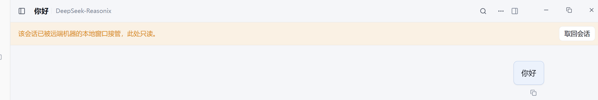
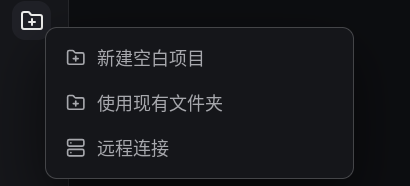
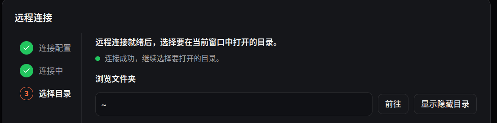
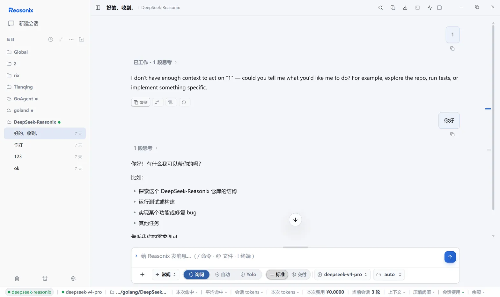

# 远程会话系统

<a href="../README.zh-CN.md">README</a>
&nbsp;·&nbsp;
<a href="./REMOTE_SESSIONS.md">English</a>
&nbsp;·&nbsp;
<a href="./GUIDE.zh-CN.md">通用指南</a>

远程模块（Remote SSH）让 Reasonix 在远端主机上运行，并通过你自己的 SSH
连接访问——VS Code Remote-SSH 式的体验。本文完整描述这套系统：组件分布、
主机配置、CLI、远端 serve 进程、会话生命周期、桌面端、凭据模式与故障排查。

## 目录

- [远程模块是什么](#远程模块是什么)
- [组件分布：什么运行在哪里](#组件分布什么运行在哪里)
- [主机与配置](#主机与配置)
- [用 CLI 连接](#用-cli-连接)
- [远端 serve 进程](#远端-serve-进程)
- [远程会话生命周期](#远程会话生命周期)
- [桌面端远程工作](#桌面端远程工作)
- [凭据与模型接入](#凭据与模型接入)
- [连接行为与故障](#连接行为与故障)
- [故障排查](#故障排查)
- [命令速查](#命令速查)

## 远程模块是什么

Reasonix 在远端主机上引导一个常驻的 headless `reasonix serve`，把本地一个
回环端口经 SSH 隧道转发过去，再通过隧道打开 serve 的 Web 客户端或在桌面
应用内打开远程会话标签页。agent、工具与文件全部原生运行在远端主机上，
保真度 100%，不经过有损的文件代理。

- V1 的远端主机仅支持 Linux 与 macOS。本地 CLI 与桌面端也可在 Windows
  运行，但 V1 的 Windows 认证不支持 OpenSSH 命名管道 agent；请改用
  身份文件或密码。
- 没有本地后台守护进程：CLI 的 `connect` 是前台监督器，桌面端自己持有隧道。
- 断开本地连接不影响远端 serve——它继续运行，下次连接直接复用。

## 组件分布：什么运行在哪里

```
本地侧                                     远端主机
──────────                                ──────────
reasonix remote … (CLI)                   ~/.reasonix/remote/
桌面应用 / 独立 Web 窗口                    serve-<slug>.{json,token,port,pid,log}
        │                                          │
        ▼                                          ▼
受监督的 SSH 连接 ──────── SSH 隧道 ──────── headless reasonix serve
（keepalive、指数退避重连、                    绑定远端 127.0.0.1:0，HTTP + SSE
 TOFU 主机密钥、SFTP）                         agent / 工具 / 文件全部在远端
        │
        ▼  本地回环 -L 端口转发
浏览器打开 serve Web UI，或桌面应用内远程会话标签页
```

- **本地前端**：`reasonix remote …` CLI；桌面应用（Electron）；serve 自带的
  Web 客户端（浏览器打开，或由独立的 Web 窗口子进程承载）。
- **传输内核**：一条受监督的 SSH 连接——拨号、主机密钥校验、挂载端口
  转发、keepalive、断线退避重连。CLI 与桌面共用同一内核；需要交互的
  场景（TOFU 确认、密码/口令输入）通过回调交给前端呈现。
- **远端**：headless `reasonix serve`，只绑定远端回环地址，端口、认证
  token、pid 经文件交接，不暴露给远端公网。
- **数据面**：会话、工具执行、文件操作全部发生在远端主机上；本地只负责
  转发与呈现。远端文件浏览/编辑走 SFTP，不经 serve。

## 主机与配置

主机保存在用户级 `config.toml` 的 `[remote]` 段。与 `[secrets]` 一样，
项目级 `reasonix.toml` 无法注入或覆盖远程主机——克隆的仓库永远无法左右
Reasonix 向何处发起 SSH 连接。

```toml
[remote]
[[remote.hosts]]
name            = "gpu-box"
host            = "203.0.113.7"
user            = "dev"
identity_file   = "~/.ssh/id_ed25519"
workspace       = "~/projects/app"
serve_install   = "auto"            # auto | npm | upload | never
credential_mode = "remote"          # remote | local-proxy

[[remote.hosts.forwards]]
type   = "local"                    # local (-L) | remote (-R)
bind   = "127.0.0.1:5432"
target = "127.0.0.1:5432"
```

### 主机字段

| 字段 | 说明 |
| --- | --- |
| `name` | 主机名，CLI 子命令用它引用 |
| `host` / `port` / `user` | 地址与登录用户；端口缺省 22，用户缺省当前用户 |
| `identity_file` | 私钥路径。只存路径，从不存储私钥内容 |
| `passphrase_env` / `password_env` | 存放口令/密码的环境变量名，值放在 Reasonix 全局 `.env` |
| `proxy_jump` | 跳板链，OpenSSH `ProxyJump` 语法 |
| `workspace` | 默认远端工作区 |
| `serve_install` | 远端 CLI 安装策略：`auto` \| `npm` \| `upload` \| `never` |
| `credential_mode` | `remote`（密钥在远端）\| `local-proxy`（桌面持钥），默认 `remote` |
| `use_ssh_config` | 未显式设置的字段从 `~/.ssh/config` 分层取值 |

`[[remote.hosts.forwards]]` 随主机持久化端口转发。`type` 选择 `local`
（`-L`）或 `remote`（`-R`）。对于 `-L`，`bind` 在本地监听，`target`
由远端主机拨号；对于 `-R`，`bind` 在远端主机监听，`target` 由本地拨号。

`[[remote.projects]]` 把远程工作区固定到桌面项目树：`host_id` + `workspace`
+ `title`。

### 凭据槽位

桌面主机表单实际收到明文密码或密钥口令时，Reasonix 才会在全局 `.env`
中创建 `REASONIX_REMOTE_<哈希>_PASSWORD` /
`REASONIX_REMOTE_<哈希>_KEY_PASSPHRASE` 槽位（原子写入，失败回滚），
并在 `config.toml` 中只记录槽位名。明文字段留空会保留现有引用，不会创建
新槽位。删除主机或显式清除凭据时会回收不再使用的生成槽位；用户手工
配置的环境变量永不删除。

### 主机解析优先级

1. `[remote]` 中显式设置的字段；
2. 本机 `ssh -G` 的解析结果（权威；覆盖 `Include`、通配 `Host`、`Match`
   （含 `Match exec`）、多个 `IdentityFile`、`ProxyJump`、`IdentitiesOnly`）；
3. 内置的 `~/.ssh/config` 解析器；
4. 缺省值（端口 22、当前用户）。

`reasonix remote import` 保存原始别名并置 `use_ssh_config = true`，不复制
一份容易过期的解析快照。

## 用 CLI 连接

### 主机管理

```bash
reasonix remote add gpu-box dev@203.0.113.7 --workspace '~/projects/app'
reasonix remote import --all        # 从 ~/.ssh/config 导入别名
reasonix remote test gpu-box        # 拨号 + 认证 + 主机密钥检查
reasonix remote list                # 列出已配置主机
reasonix remote remove gpu-box
```

### connect：前台监督器

`connect` 相当于 `ssh -N` 加上 serve 引导：建立并保持 SSH 连接、引导远端
serve、把远端 serve 端口转发到本地回环，并挂载已配置的转发。断线时以
指数退避自动重连，重连后重新挂载转发。Ctrl-C 只断开本地一侧——远端
serve 继续运行，下次 `connect` 直接复用。

```bash
reasonix remote connect gpu-box --open   # 引导 serve、建隧道、打开 URL
reasonix remote open gpu-box             # 等价于 connect --open
reasonix remote connect gpu-box --local-port 18787 --no-serve
```

`--no-serve`（别名 `--forward-only`）只建立转发，不引导 serve。

对于 `credential_mode = local-proxy` 的主机，请通过桌面端引导并打开工作区。
CLI `remote connect` 不会建立桌面持有的反向凭据通道；仅需普通端口转发时，
可以使用 `--no-serve`。

### 远端 serve 运维

```bash
reasonix remote serve start gpu-box
reasonix remote serve status gpu-box
reasonix remote serve logs gpu-box -n 100
reasonix remote serve stop gpu-box
```

`serve start` 拒绝 `credential_mode = local-proxy` 的主机。必须由桌面端引导
serve 并提供反向凭据通道。

### 端口转发与远端文件

```bash
reasonix remote forward add gpu-box -L 127.0.0.1:5432:127.0.0.1:5432
reasonix remote forward ls gpu-box
reasonix remote forward rm gpu-box 127.0.0.1:5432
reasonix remote fs ls gpu-box:'~/projects/app'
reasonix remote fs get gpu-box:'~/projects/app/main.go' ./main.go
reasonix remote fs put ./patch.diff gpu-box:'~/projects/app/patch.diff'
```

`fs` 子命令走 SFTP，不需要 serve 在运行。

## 远端 serve 进程

每个工作区一个 serve：远端状态文件按工作区 slug 命名，互不影响。

**引导流程**（`connect` 或桌面打开远程项目时自动执行）：

1. 尝试复用运行中的 serve——pid 与启动参数完全匹配才算存活，防止 pid
   复用误判；
2. 探测远端平台与二进制（见安装阶梯）；
3. 生成新的认证 token：先写 `.token.next` 再原子改名，避免读到半写状态；
4. 以 `setsid`/`nohup` 分离启动 `reasonix serve`：绑定 `127.0.0.1:0`，
   token 经 `--token-file` 传入（不进 argv，不会出现在 `ps` 中），端口与
   pid 分别写入 `.port` / `.pid` 文件；
5. 轮询端口文件就绪后，写状态 JSON 并建立本地转发。

**二进制安装阶梯**（`serve_install = "auto"` 时按序尝试）：

1. 远端已有的 Reasonix 二进制；
2. `npm` 全局安装；
3. 上传本机同平台的二进制到远端 `~/.reasonix/remote/bin/`；
4. 从官方 release 下载。

二进制是否可用由能力探测决定而非版本号：缺少所需 serve 能力的旧二进制
会被当作缺失并升级。`serve_install = "never"` 禁止任何安装。

**远端状态文件**（远端 `~/.reasonix/remote/`）：`serve-<slug>.json`（pid、
绑定的回环地址、工作区）、`serve-<slug>.token`（0600）、`serve-<slug>.port`、
`serve-<slug>.pid`、`serve-<slug>.log`。

**访问 URL**：`http://127.0.0.1:<本地端口>/#token=<token>`。token 放在 URL
fragment 中，不会随请求进入服务器日志；旧版 serve 自动回退 `?token=`
查询参数。

**停止**：`serve stop` 只对 pid 与启动参数完全匹配的进程发信号，不会误杀
无关进程。

**并发引导**：多个客户端同时引导同一工作区时，由远端文件锁串行化；锁
60 秒无活动自动过期回收。

## 远程会话生命周期

- 一个 serve 承载一个**前台会话**。切换到别的会话时，正在执行的回合在
  后台分离运行直至完成，不会被打断。
- 会话有唯一写者（租约）：被其他进程持有时，恢复该会话会被拒绝，界面
  显示“会话占用中”。
- **接管**（handoff）：serve 主机上的本地窗口可以接管前台会话。此时
  serve 降级为只读镜像，实时转发本地写者的帧；30 秒收不到写者心跳即
  自动收回，也可显式收回。桌面远程标签页此时进入旁观模式并显示收回
  横幅。
- 桌面项目树列出该工作区的远程会话；点击会话行即在共用的 Transcript
  与 Composer 界面恢复该精确会话；正在运行的回合继续远端执行，项目树
  显示其运行状态。桌面端持有 SSH 隧道，并且不会把本地会话混入远程
  标签页。

以下两张图展示接管的两个端点。首先，在远端主机本地运行的 Reasonix
窗口中确认接管一个当前空闲的会话：


接管完成后，连接该主机的桌面端远程会话标签页变为只读旁观者。它仍然
接收实时 Transcript，并提供“取回会话”操作：



## 桌面端远程工作

- **设置 -> 远程 SSH**：管理主机——增删改、从 `~/.ssh/config` 扫描导入、
  连接/断开/查看状态。
- **添加远程项目**：项目树“添加项目”菜单选择 **远程连接**。三步向导：
  保存或复用 SSH 主机 → 连接并确认远端操作系统受支持 → 浏览并选择工作区，
  然后在应用内打开远程会话标签页。密钥文件按钮使用原生文件选择器，保存
  的身份文件始终是桌面端绝对路径。
- **远程浏览器**：状态栏徽标或主机行的 **远程浏览器** 按钮——经 SFTP
  浏览与编辑远端文件、管理端口转发、启动/打开远端工作区。
- **远程会话标签页**：与本地会话共用的 Transcript/Composer 界面，支持
  模型切换、推理强度、计划模式、压缩、fork、技能、后台任务等命令；
  SSH 短暂中断期间标签页保留，后台自动重连。
- **模型目录**：`remote` 凭据模式下直接来自远端 `/models`；`local-proxy`
  模式下显示桌面配置的目录，按当前 provider 类型过滤。
- **对话框**：TOFU 指纹确认、askpass 密码/口令输入、结构化连接错误
  （指明 `known_hosts` 文件与行号）、接管收回横幅。
- **Web 窗口**：独立子进程承载 serve 的 Web UI；登录票据写入一次性 0600
  文件（2 分钟有效），不进 argv；每个主机单实例。

### 界面示例

项目树的添加菜单把 **远程连接** 与新建项目、打开现有文件夹放在同一个
入口：



远程连接向导在左侧显示连接配置、连接中、选择目录三个步骤。SSH 连接
成功后，可以跳转路径、显示隐藏目录并选择要在当前窗口打开的工作区：



打开后，远程项目与它的会话显示在项目树中；远程会话继续使用完整的
Transcript、Composer、模式选择、模型选择、状态栏与会话指标界面：



## 凭据与模型接入

| | `remote` | `local-proxy` |
| --- | --- | --- |
| API Key 存放 | 远端主机的 Reasonix 配置 | 桌面本机 |
| 模型调用路径 | 远端 serve → provider | 远端 serve → 反向隧道 → 桌面持钥代理 → provider |
| 模型列表来源 | 远端 `/models` | 桌面配置目录（按 provider 类型过滤） |
| CLI | 完整支持 | `remote serve start` 会拒绝；`remote connect` 无法提供桌面持有的凭据通道。请使用桌面端（普通转发仍可用 `--no-serve`） |

`local-proxy` 模式的功能行为：

- 桌面在远端 `config.toml` 注入一个托管的 `[[providers]]` 块，指向反向
  隧道地址与作用域受限的 token；该块由 Reasonix 维护，不要手工编辑。
- 凭据 watchdog 每 3 秒巡检反向隧道：转发缺失、探针失败或端口漂移都会
  触发全量修复并重载 provider。SSH 重连后隧道密钥必然轮换（即使端口
  未变），因此重连后总是无条件修复一次。
- 短暂 SSH 中断后通道自动恢复，无需人工干预。

输入过的密码与密钥口令缓存在内存中，重连不会重复提示；桌面端重启后
需要重新输入。

## 连接行为与故障

- **keepalive**：每 30 秒探测一次，连续 3 次无响应（单次 10 秒超时）判定
  断线，拆链重拨。
- **重连退避**：全抖动指数退避——1 秒起步、每次翻倍、上限 60 秒。首次
  连接的瞬态失败立即报错，不会静默重试。
- **终态故障**：认证失败与主机密钥错误不重试；桌面端把远程工作区标记为
  不可用，等待人工处理。短暂网络中断则保留界面，后台自动重连并重新
  挂载转发。
- **主机密钥**：对照你的 OpenSSH `~/.ssh/known_hosts`（只读）与 Reasonix
  托管的 `~/.reasonix/remote/known_hosts`。首次见到的密钥提示 TOFU 确认
  并记入托管文件；与已记录密钥冲突的是硬错误，指明出错的文件与行号，
  绝不自动接受。
- **认证顺序**：SSH agent → `identity_file` → 密码 / kbd-interactive。
- **跳板机**：`ProxyJump` 的每一跳各自校验主机密钥、使用各自的凭据；
  目标主机的密码不会发给上游跳板。
- **转发语义**：`-L` 本地监听跨重连存活（断开期间新连接被拒绝）；
  `-R` 每次重连重建；serve 换端口时本地转发原子切换到新地址。
  `remote forward add` 会对非回环 bind 给出警告；手工编辑的 TOML 规则会
  原样应用且不显示该警告，因此需要自行确认暴露范围。
- **SFTP**：会话句柄随重连换代，断线期间的远端文件操作失败，重连后
  恢复可用。

## 故障排查

| 症状 | 原因与处理 |
| --- | --- |
| 主机密钥冲突，错误指明 `known_hosts` 行号 | 远端重装、换地址等导致密钥变化。人工核对该行属实后，从对应文件删除该条目再连；绝不自动接受 |
| serve 起不来 | `serve_install = "never"` 但远端没有二进制；或 npm 不可用——改用 `upload` 或 release 下载。用 `remote serve logs` 查看 |
| 疑似旧 serve 不兼容 | 能力探测不通过会自动升级；必要时 `remote serve stop` 后重新 `connect` 强制重新引导 |
| `connect` 卡在引导阶段 | 并发引导由远端文件锁串行化，锁最多 60 秒自动过期；稍后重试 |
| 会话显示“占用中” | 其他进程持有该会话的租约（另一个窗口或 serve）。从对应端退出，或等持有方释放 |
| 远程标签页进入旁观模式 | serve 主机上的本地窗口接管了会话；30 秒无心跳自动收回，或点击收回横幅 |
| `local-proxy` 模型调用失败 | watchdog 会自动修复；确认桌面端在线且 SSH 已连接。远端托管 provider 块勿手工编辑 |
| 认证失败反复出现 | 认证失败是终态故障，不会重试。核对 `.env` 槽位、密钥口令，或改用 SSH agent |
| Windows 本地端 | CLI 与桌面端可用，但 V1 不能使用 OpenSSH 命名管道 agent；请配置身份文件或密码。远端主机仍须是 Linux/macOS |

## 命令速查

| 命令 | 作用 |
| --- | --- |
| `remote add <name> [user@]host[:port]` | 添加主机。标志：`--identity`、`--jump`、`--workspace`、`--use-ssh-config`、`--serve-install`、`--credential-mode`、`--passphrase-env`、`--password-env` |
| `remote list` | 列出已配置主机 |
| `remote remove <name>` | 删除主机 |
| `remote import [alias...]` / `--all` | 从 `~/.ssh/config` 导入别名 |
| `remote test <name\|user@host>` | 拨号 + 认证 + 主机密钥检查 |
| `remote connect <name>` | 前台监督连接：引导 serve、建隧道、挂转发，保持到 Ctrl-C。标志：`--workspace`、`--local-port`、`--no-serve`、`--open` |
| `remote open <name>` | `connect --open` |
| `remote status [<name>]` | 无主机名时列出已配置主机；指定主机时输出该主机配置的目标与工作区 |
| `remote forward add <host> (-L\|-R) <spec>` | 添加端口转发 |
| `remote forward rm <host> <bind>` | 删除转发 |
| `remote forward ls <host>` | 列出转发 |
| `remote serve start\|stop\|status\|logs <name>` | 远端 serve 生命周期；`--workspace` 选工作区，`logs -n` 控制行数 |
| `remote fs ls <name>:<path>` | 列出远端目录 |
| `remote fs get <name>:<remote> [local]` | 下载远端文件 |
| `remote fs put <local> <name>:<remote>` | 上传文件到远端 |

相关文档：[配置路径](./CONFIG_PATHS.zh-CN.md)（`config.toml` 与 `.env`
的位置与优先级）、[主指南](./GUIDE.zh-CN.md)。
